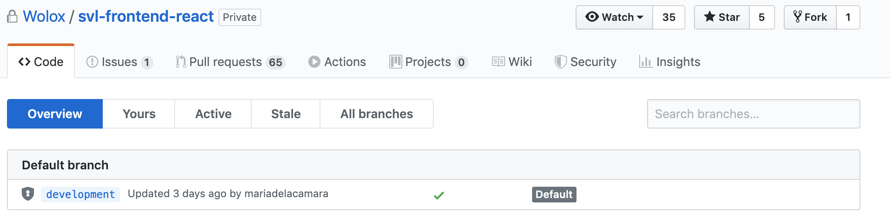
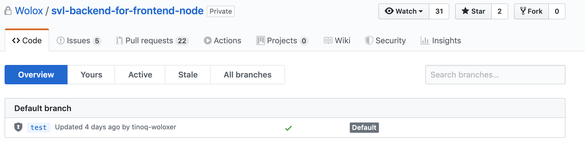
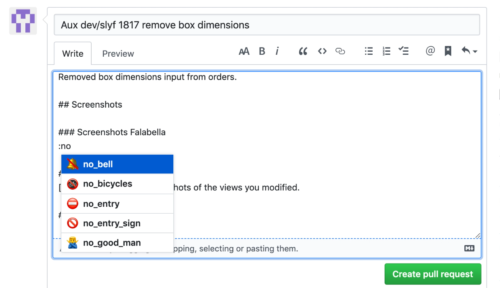

Nuestro punto de partida sera Default branch.

#### development en el caso del front 


#### test en caso del backend.
 

## Steps

Dependiendo de la rama en la cual estemos posicionados al comienzo, 

1. git checkout release.
2. git checkout -b `historyName-featureName`.
3. realizar los commit's correspondientes.
4. git push origin `historyName-featureName`.
5. git checkout development.
6. git pull origin development.
7. git checkout -b `aux-dev/historyName-featureName`.
8. git merge `origin/historyName-featureName`. Dependiendo de los cambios deberemos o no, resolver los conflictos correspondientes.
- `:q` para salir de vim.
9. git push origin `aux-dev/historyName-featureName`.
Dentro de la consola ya nos deberia arrojar el link de github donde se ha realizado el pull request.
- Example:  
`Create a pull request for 'aux-dev/historyName-featureName' on GitHub by visiting:`
`https://github.com/Wolox/././...`
- Si nos fijamos en en cada proyocto hay un pull_request_template.md
```
## Summary

[Change!] Describe your feature, problems you had, notes, improvements and others.

## Screenshots

### Screenshots Falabella
[Change!] Show the screenshots of the views you modified.

### Screenshots Sodimac
[Change!] Show the screenshots of the views you modified.

## Trello Card

[Change!] Link to the associated Trello card.
```
10. Completamos el write del pull request.
    1. Obviamente nuestro pull solo modificara a falabella o a sodimac, po lo tanto, el que no modifiquemos lo debemos aclarar de alguna forma.
    
    2. Cambiamos `## Trello Card` por `## Jira Card`.
    3. Añadimos el link de la historia de jira.  
    `[historyName](link-historyName)`  
    Example: `[SLYF-1817](https://jira.adessa.cl/browse/SLYF-1817)`
    4. Asignamos el label. `Development` en este caso.
11. hacemos el pull request.
12. Repetimos el mismo paso con el pull a release.
    1. Añadir el link del pull de development  
    `Dev PR: [# devPullId](devPullLink)`  
    Example: `Dev PR: [# 6144](https://github.com/Wolox/svl-frontend-react/pull/6144)`